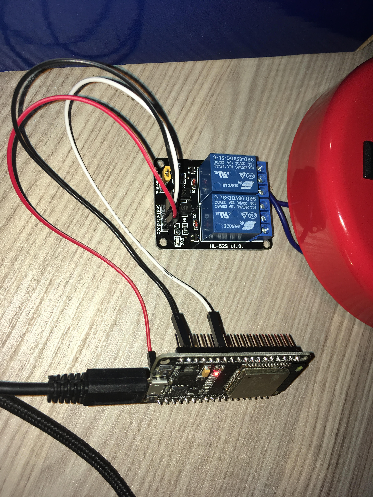

## Internet Controllable Desk Lamp with Alarm-Timer Features

The human body is conditioned to wake up when the sun is providing light. Many of us get up from our beds tired when we set our alarms to the darkest hours of day to get to our workplaces(disgusting combination of early working hours and meaningless national time policy). This project is inspired by the basic knowledge about human biology. Users of this project can do;

1. Set alarm to any time to light up the desk lamp: Setting 5-10 minutes before your sound alarm will help you to wake up smoother. It is easier to wake up when there is sun shining into your room or any other light source. 
2. Set timer to any time to shut down the desk lamp: If you are reading anything before sleeping, have difficulty passing into sleep in darkness or for any other reason, use timer to program your desk lamp to go off.
3. Light up or shut down the desk lamp instantly: You can use these direct commands to get results immediately.

Note: This project can be used as a base to control any other 220V electric device. Desk Lamp is only the theme of the project.

### Hardware

ESP-32, Songle 2-way 5V relay and a desk lamp are used to create this project. You can also use your smartphone with an app capable of connecting to a server and sending data. For this task, I used TCP Console app for IOS.

### Connections

#### ESP-32 to Relay

2-way relays have Vcc, GND, ln1 and ln2 pins. Vcc and GND is self explanatory, ln1 is for the first relay and ln2 is for the second relay.

1. ESP-32 3.3v    -> Relay Vcc
2. ESP-32 GND     -> Relay GND
3. ESP-32 GPIO-12 -> Relay ln1

ESP-32 GPIO-12 will be used to switch on/off the relay. LOW voltage from GPIO-12 will switch on the relay, allowing the electricity to pass over relay. HIGH voltage from GPIO-12 will switch off the relay, preventing the electricity to pass over relay.

#### Relay to Desk Lamp

We will use only one of the relays(First one, the left one when you can read the writings on the circuit properly). First, cut the power off from the desk lamp. Second, if the desk lamp has button, push it to OFF mode. Then, inspect your desk lamp's cable, cut the hot wire(non-ground wire) at some convenient point. Put one side of the cut wire to NO(Normally Open) slot and the other to Common slot(generally the middle slot). After making sure there is no shortcut between two sides of the open cable, you can safely provide power to desk lamp and if it has a button, push it to ON mode.

### Software

This software uses **WiFi** and **time** libraries to provide network and timing capabilities. In the source code, you have to provide your own WiFi SSID and WiFi password to connect to your WiFi modem. After connecting to WiFi, the software will use Network Time Protocol to get local time. After these steps are automatically done, the software will be waiting a new TCP client to connect and send simple commands in the formats given below;

1. **Light Up**: Simply send **O** character to ESP-32. The lamp will be lighted up immediately.
2. **Light Down**: Simply send **C** character to ESP-32. The lamp will be shut down immediately.
3. **Alarm**: The desk lamp will be lighted up at given time. Start your command with **A** character, then resume with mandatory **hour** parameter and optional **minute** parameter. For example, if you send **A08**, it will activate at **08:00**. If you send **A1245**, it will activate at **12:45**. Hour must be first parameter with 2 digits and minute must be second parameter with 2 digits. Since it is an open source software, you can change how you interpret these commands and change structure.
4. **Timer**: The desk lamp will be shut down after given time has past. Start your command with **R** character, then resume with mandatory **hour** parameter, optional **minute** parameter and optional **second** parameter. For example, if you send **R01**, it will shut down at after 1 hour. If you send **R0045**, it will shut down after 45 minutes. If you send **R002515**, it will shut down after 25 minutes and 15 seconds. Hour must be first parameter with 2 digits, minute must be second parameter with 2 digits and seconds minute must be third parameter with 2 digits. Since it is an open source software, you can change how you interpret these commands and change structure.

### Software Build&Deploy
1. Open **DeskLampIoT.ino** in **Arduino IDE**
2. Click **Tools** -> **Board**, in the menu, choose ESP-32 Dev Module
3. Click **Tools** -> **Port**, choose the appropriate COM port
4. Click **Upload**

Note: Make sure you have installed ESP-32 libraries to Arduino IDE.

### Test

These instructions are written according to the TCP Console IOS App. There must be an Android counterpart but steps would be similar.

1. Open the app
2. From the bottom bar, *click* to Client button
3. ESP-32' s IP will be announced at serial windows of Arduino IDE. You can also check your modem's webpage(local one) to see connected devices. Enter ESP-32' s IP to **Address** field.
4. Enter the port number in the source code to **Port No.** field.
5. Make sure your smartphone is connected to same modem as ESP-32 and click **CONNECT** button at the top left. If you want to control ESP-32 from the outer internet, use port forwarding. There are plenty sources online for this matter.
6. After you see **Connected** in **Status** field, click the **Console** button.
7. Test your commands as given in the 

### Example Recordings

