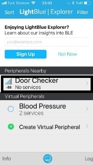
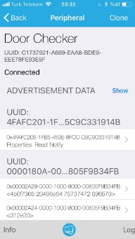
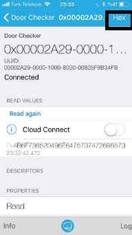
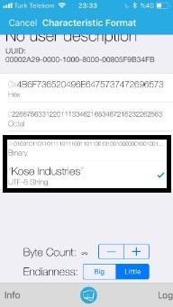
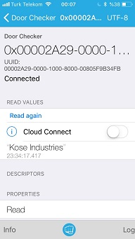
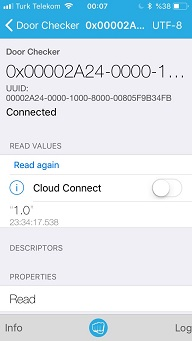
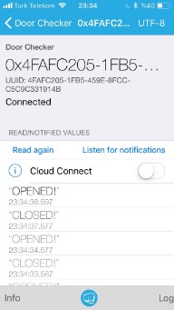

## Door Checker

This is a door open/closed status checker project. An obstacle sensor is used to check the status of the door and Bluetooth Low Energy is used to communicate this status with the user. The device sends status information to the user whenever the door is opened or closed.

### Hardware
ESP-32 development kit and FC-51 obstacle sensor is used to implement this project. As a power source, to make project disconnected from the PC and portable, single cell(3.7 V) LiPo battery can be used easily. 

[FC-51](http://qqtrading.com.my/ir-infrared-obstacle-detaction-sensor-module-fc-5)

### Connections
#### Connected to PC
During development and installation of software, setup is connected to PC. Power source is the PC, therefore configuration is really simple. 

+ ESP-32 GPIO 18 -> FC-51 OUT
+ ESP-32 3.3 V   -> FC-51 VCC
+ ESP-32 GND     -> FC-51 GND

#### Disconnected from PC
We will deploy our setup to the door, therefore it is better to power it with LiPo battery instead of longer USB cable.

+ LiPo Positive -> ESP-32 3.3 V (Yes, 3.3 V can be used for powering the dev. kit also)
+ LiPo Positive -> FC-51 VCC
+ LiPo Ground -> ESP-32 GND
+ LiPo Ground -> FC-51 GND
+ ESP-32 GPIO 18 -> FC-51 OUT

### Software
In this example, the setup is used as BLE Peripheral device. "Door Checker®" periodically checks the status of the door(open or closed) and notifies the connected users when status is changed. So it is an aperiodic notification. This notification is realized with **Door Check** service and **Door Status** characteristic. If you do not understand the terms service or characteristic, please refer to **README** at the repository level. 

### Software Build&Deploy
1. Open **ESP32_Obstacle.ino** in **Arduino IDE**
2. Click **Tools** -> **Board**, in the menu, choose ESP-32 Dev Module
3. Click **Tools** -> **Port***, choose the appropriate COM port
4. Click **Upload**

Note: You can check the correct port by opening Device manager and plugging out/in, then checking which port is changed. If you did not install the correct USB driver, you will fail to choose correct port. If so, please refer to repository level README.

### Setup Deployment
Prepare the "**Disconnected from PC**" configuration explained in the **Connections** section. Put the setup to the sides of the door where obstacle sensor will be blocked when the door is closed. Make sure ESP-32 is powered. The software, without any user intervention, will start Bluetooth service.

### Test
If you are using the **LightBlue** application as suggested, follow the steps below. Any other Bluetooth scanner application would suffice.

1. Push to **Door Checker** tab at the main screen of the app.

2. At the very top, you will see "**Door Checker**" name and UUID of the device.Under the UUID, connection status will be written.Make sure you are in **Connected** state.

3. At the bottom, you will see the list of service and characteristic UUIDs in a hierarchical manner. Since we are using general purpose application, we can not name the services by their UUID. But still, we can use UUIDs to distinguish services.

4. UUID starting with "**0000180A...**" belongs to the **Device Information** service, under that, **Manufactor Name** and **Model Number** characteristics. Click **Manufactor Name** characteristic open a screen specific to it. At the top right, click **Hex** button and choose **UTF-8** option to read strings properly. Repeat it for **Model Number** characteristic. 

 

5. UUID starting with "**4FAFC201...**" belongs to the **Door Check** service, under that, **Door Status** characteristic. Repeat the step 4 for **Door Status** characteristic to see status of the door. This characteristic has **notify** property. To see notifications, click to the Listen for notifications button.

